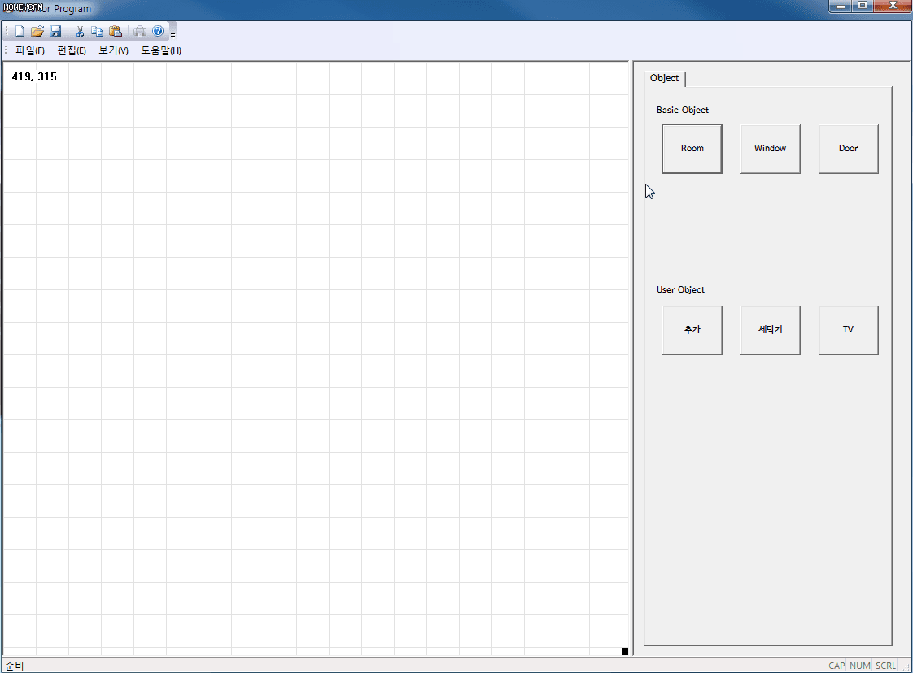
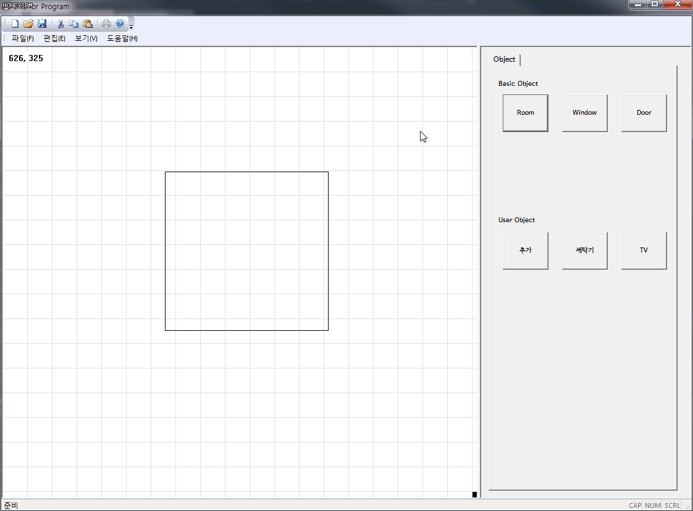
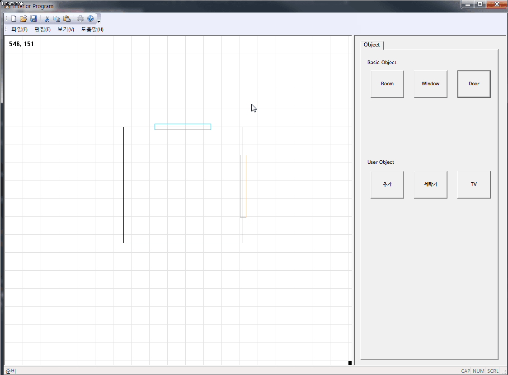
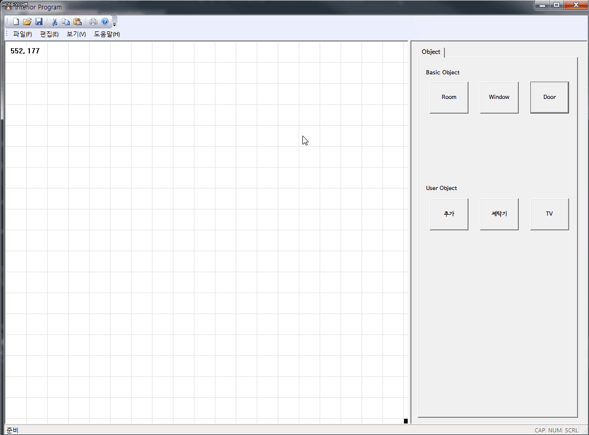
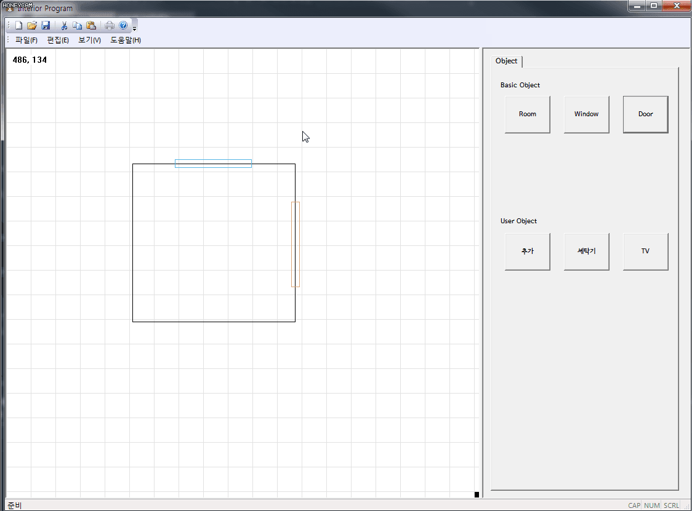
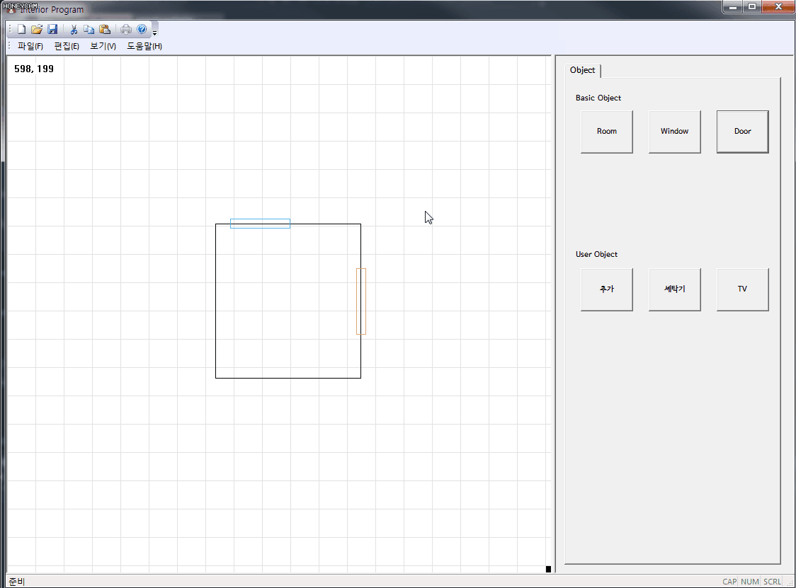
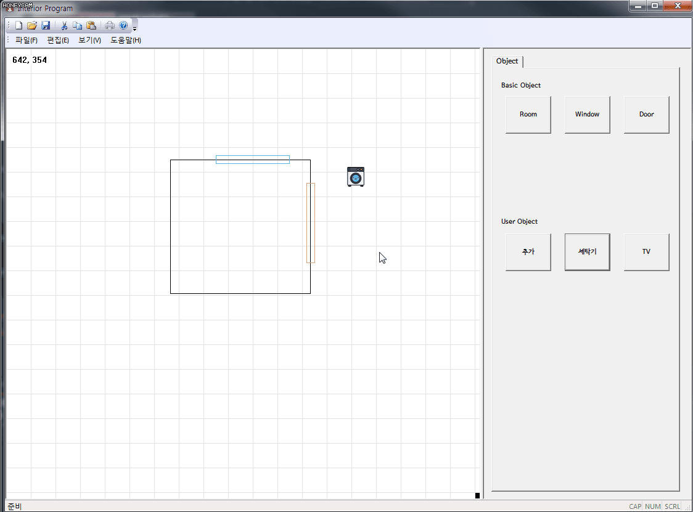
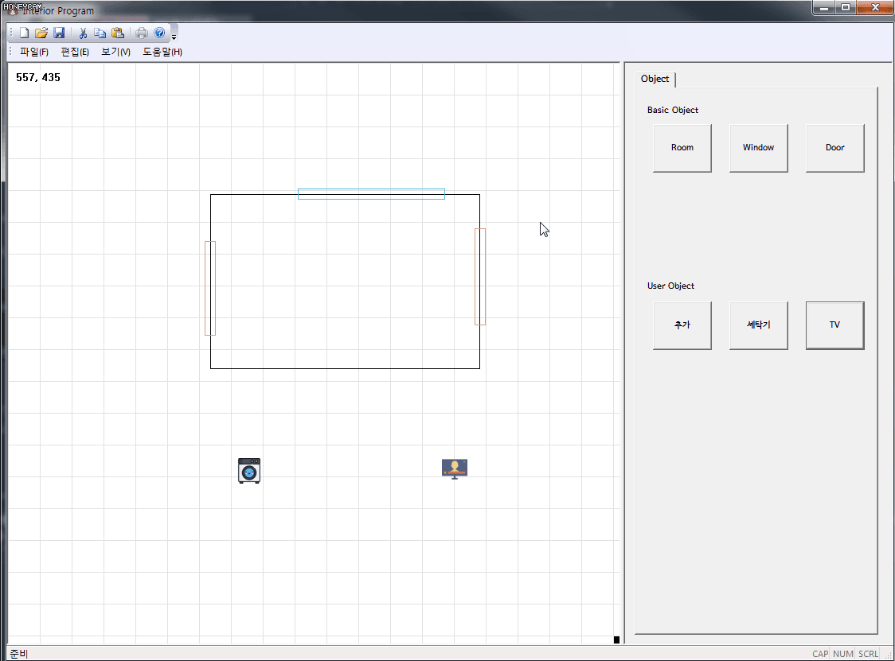
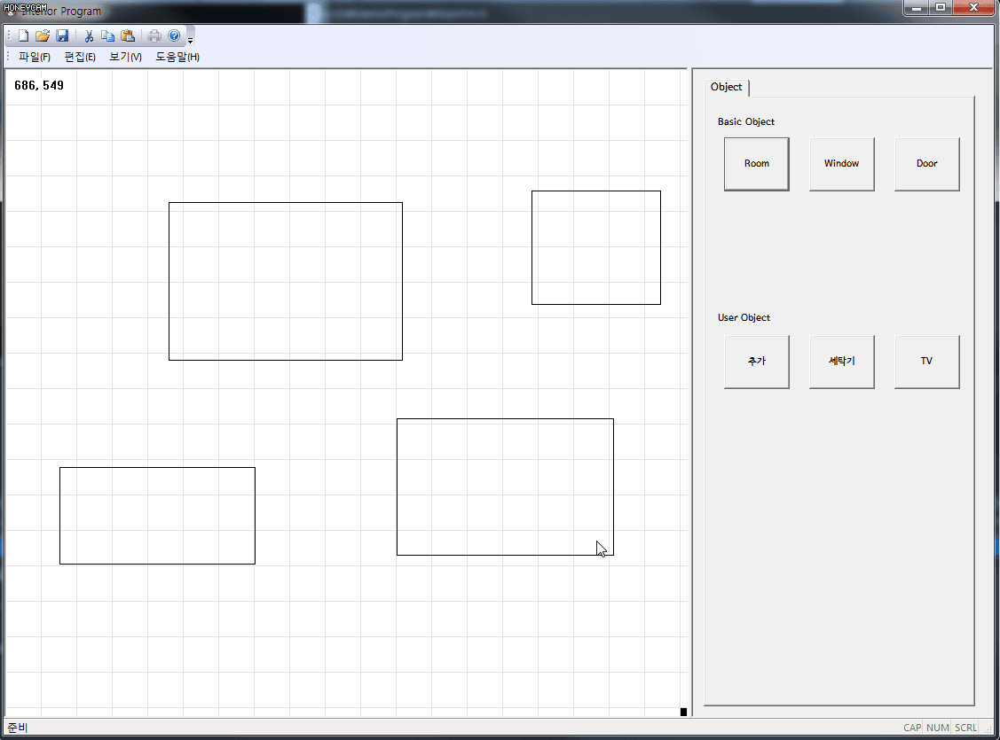
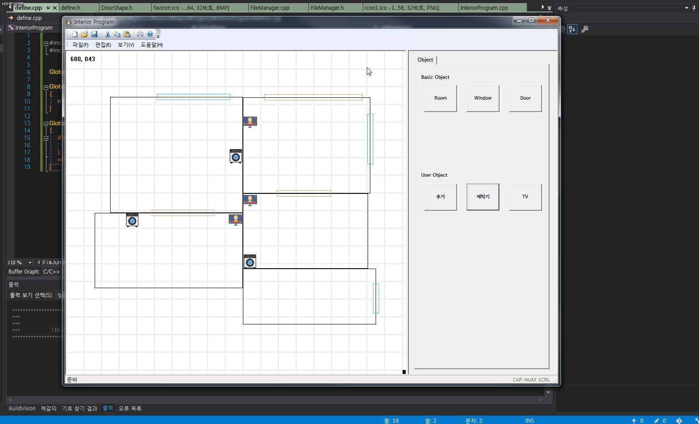

# MFC InteriorProgram

## 구현 기능

### 그래픽

#### Draw room, Select, Move



#### Draw window, door



#### Move group



#### Draw user object



<br/>

### 편집

#### Copy, Paste (```ctrl + c, ctrl + v```)



#### Scale (```mouse wheel```)



#### Edit (```Dbclick or 마우스 오른쪽 클릭```)



#### delete (```ctrl + x, 마우스 오른쪽 클릭```)



<br/>

### 편의 기능

#### Magnetic



#### Redo, Undo (```ctrl + y, ctrl + z```)  구현 중

#### Save, Load  구현 중

#### Capture




<br/>

### 전체 시연 영상

<https://www.youtube.com/watch?v=ldUrHtPFh3A&feature=youtu.be>

<br/><br/>


## 첫 과제

* [09.10] 시작!
* 2번 째 과제
* 마이다스 코딩 규칙에 맞춰서, 마이다스 챌린지 때 했던 것을 자바에서 C++로 구현


## 단일 문서 기반(SDI)

### Project View Structure


### Project Model Structure


### 전체 간단한 구조도


### 프로젝트 시작 방법

> 보고 쭉 따라오되 유의 사항만 지키면 됨

1. [단일 문서 기본 틀 생성](http://ryumin13.tistory.com/entry/mfc%EB%A1%9C-%ED%88%B4%EB%A7%8C%EB%93%A4%EA%B8%B0-%EA%B8%B0%EB%B3%B8-%EB%BC%88%EB%8C%80-%EB%A7%8C%EB%93%A4%EA%B8%B0?category=388236)

2. FormView가 VisualStudio 2017에서 생성이 안 됨, 본 프로젝트에 있는 ControlView를 복붙하여 사용

3.  CBufferDC는 진짜 혁명!
  * 원하는 View의 OnEraseBkgnd 메시지 함수를 아무것도 동작하지 않게 return TRUE로 바꿈
  * CBufferDC 만듬
  * OnPaint에 dc를 이거로 교체하면 끝!
  * repaint()시 깜빡임이 바로 없어짐

4. MVC 패턴에 따른 필터 구성

### 프로젝트 개발 Log

* [Midas Log](https://github.com/wnsgml972/midas_log/blob/master/contents/2018.09/09.md),  [09.10] 부터 볼 것
